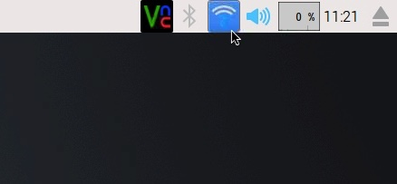
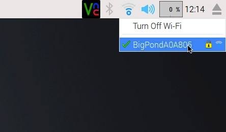
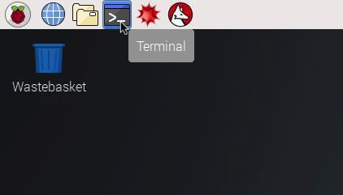
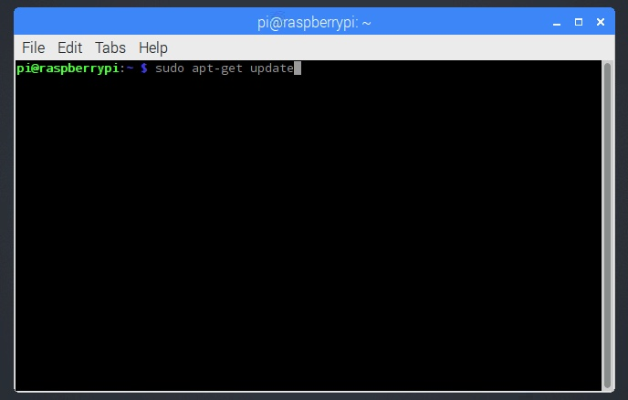
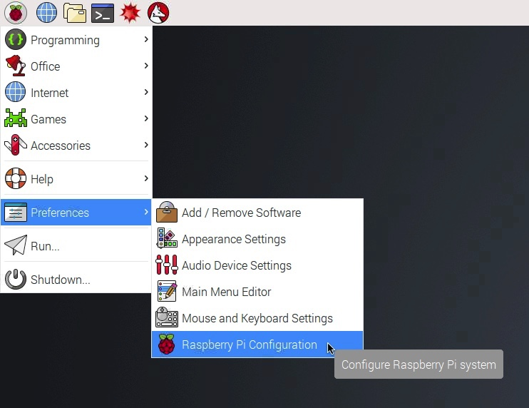
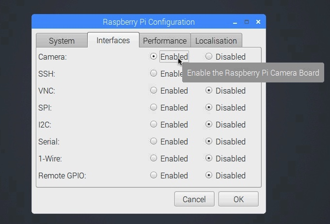
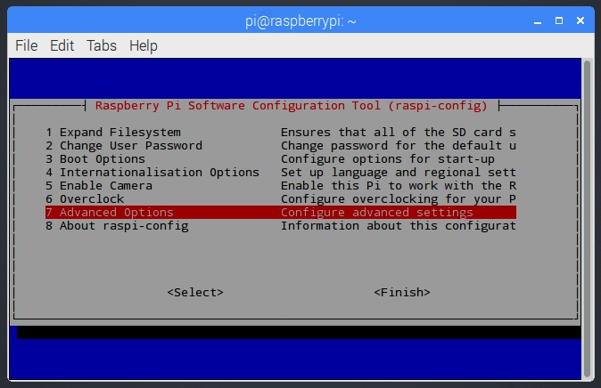
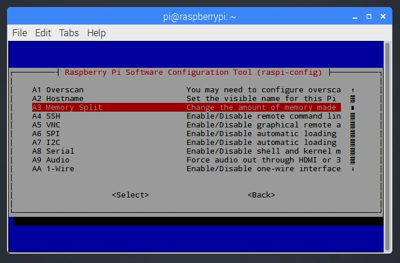
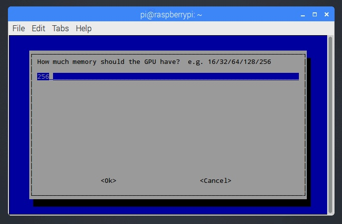

# Raspberry Pi Setup

## Parts

Quantity | Part | Additional information
---------|------|---------
1|Raspberry Pi 3 Model B|For more information see [http://raspberrypi.org](https://www.raspberrypi.org/products/raspberry-pi-3-model-b/)
1|USB Keyboard|
1|USB Mouse|
1|HDMI video cable|
1|HDMI to DVI-D adapter| Optional. Some monitors have a HDMI port, but if it doesn't then it probably has a DVI-D port in which case you will need the adapter.
1|Micro-USB cable and 5V (2.5 Amp) USB power supply|All Raspberry Pi stockists will sell a USB cable and power supply with the correct current and voltage for the Pi. For a permanent setup this is ideal but any micro USB cable plugged into the USB port on a computer will also work (useful for initial setup).
1|Wireless Network|An internet connection is required to setup the Pi.
1|16GB+ microSD card|We recommend storing captured images on an external hard drive or a good quality USB memory stick, but if a more compact setup is preferred then a larger capacity microSD card (200GB+ are now available) can be used.
1|Laptop or desktop computer|To install the Pi operating system on the microSD card.

## Instructions

These instructions assume you are using a new and unused Pi and a blank microSD card.

### Install the Raspberry Pi operating system on the microSD card

1.  Follow the instructions at [http://raspberrypi.org/documentation/installation/noobs.md](https://www.raspberrypi.org/documentation/installation/noobs.md) to install NOOBS (New Out Of Box Software) on the microSD card. 

2. Insert the microSD card into the microSD card slot on the Pi.

3. Insert the USB keyboard and mouse into the USB ports on the Pi.

4. Insert the HDMI video cable into the HDMI port on the Pi and a monitor/TV HDMI/DVI-D port (adapter may be required).

5. Insert the micro USB cable into the micro USB port on the Pi and into the computer micro USB port or wall socket USB power supply.

6. Once the Pi has loaded and showing a NOOBS installation screen choose the Raspbian operating system and follow steps to complete installation.

    

### Pi Setup

1. Connect the Pi to the internet.

    Connecting the Pi v3 to the internet is much easier than previous models. You can connect the Pi to an internet-accessible network by plugging an ethernet cable into the ethernet port on the Pi and then directly into a network router. Alternatively the model 3 Raspberry Pi has Wi-Fi (enabled by default) and can be connected to any wireless network that broadcasts an SSID. At the top right of the desktop click the Wi-Fi icon on the task bar and you will see a list of available wireless networks. Click a network to join, providing a network key if required.

    
    

    **Problems connecting to a wireless network?**

    You may find that the Pi won't connect to the wireless or wired network of your organsation e.g. university. This is likely because of security.

    Most high-end smartphones have wireless hotspot capability. This allows nearby devices to use their internet connection over a temporary wireless 'hotspot' network. Usually the Pi has no problems connecting to these hotspots and may be a quick fix to get the Pi setup and running. Hotspots will be visible in the wireless network list.

2. Upgrade to the latest version of the operating system and install any updates.

    Open the terminal and enter the commands one line at time pressing return after each line and waiting for the command to finish before moving to the next. Answer Yes to any questions.

    ```
    sudo apt-get update
    sudo apg-get dist-upgrade
    ```

    
    


3. Enable the Camera

    From the start menu (raspberry icon top left of the screen) select Preferences then Raspberry Pi Configuration. Click the interfaces tab and click 'Enabled' next to Camera to enable the camera. Restart the Pi.

    
    
    

4. Increase the GPU (Graphics Processing Unit) memory.

    In the terminal enter the following command:

    ```
    sudo raspi-config
    ```

    Using the cursor keys move down to "Advanced Options", press enter then move down to "Memory Split", press enter again and change the value to 256. Press down to go to Ok and press enter. On the main menu press right to get to the Finish option and press enter to exit. Restart the Pi.

    
    
    


5. Download the image capture script (cavicapture)

    In the terminal enter the following commands, line by line:

    ```
    cd ~/
    git clone https://github.com/OpenSourceOV/cavicapture.git --depth 1
    sudo chmod +x cavicapture/cavicapture.py
    echo 'export PATH=~/cavicapture:$PATH' >>~/.profile
    source ~/.profile
    ```

7. Done! The Pi is now ready to start capturing images.


